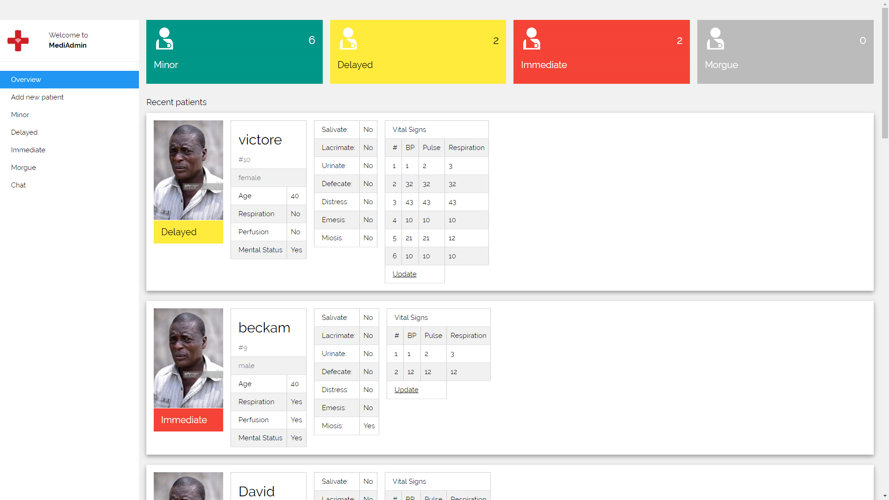
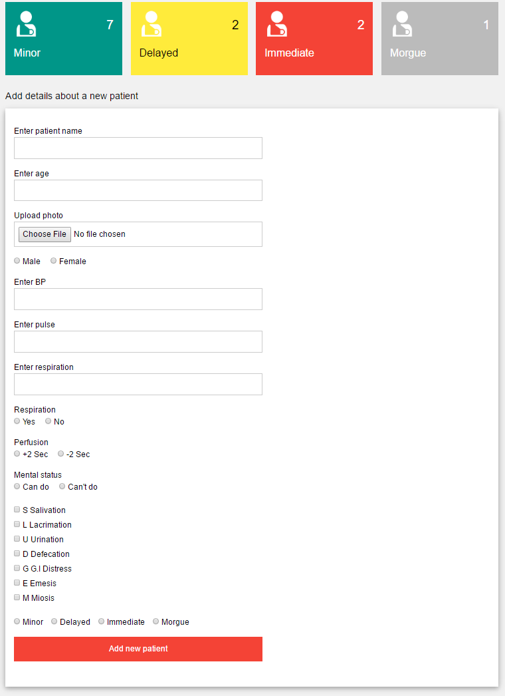
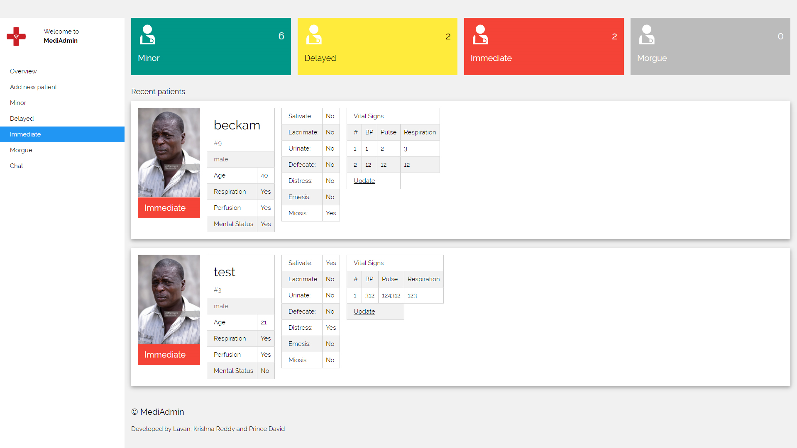
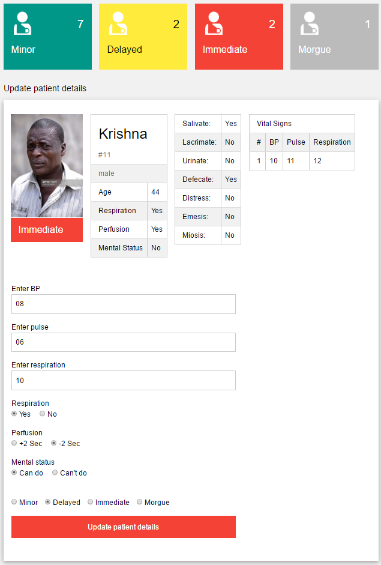
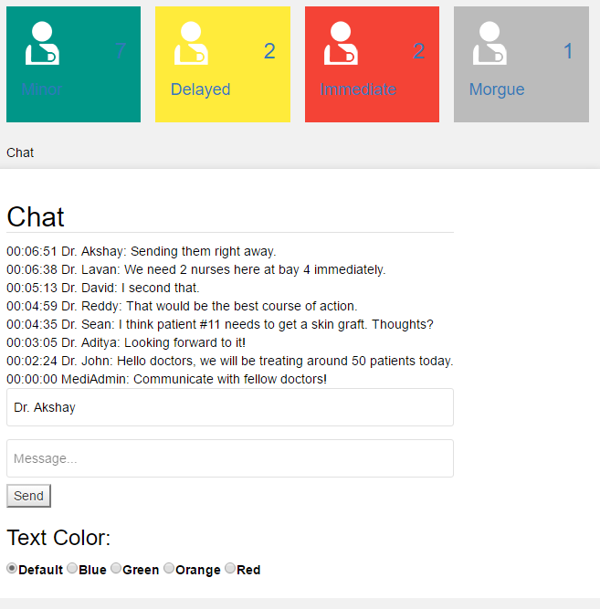

# MediAdmin
 A LibraryBox-based portable network solution for managing medical camps.
 
 MediAdmin is a portable medical camp management solution bundled as a web application within a Library-box based firmware that can run independently on a portable router and be accessed by clients (doctors) on the network.
 
 Pre-requisites
 --------------
 <ul>
 <li>Library-box installed portable router. Follow instructions <a href="http://librarybox.us/buildingv2.1.php" title="Build a LibraryBox" alt="Build a LibraryBox">here</a> to purchase a supported router, and install LibraryBox.</li>
 </ul>
 
 Deployment
 ----------
 <ul>
 <li>Clone/download the project to your computer.</li>
 <li>Power down the router, unplug the USB drive, plug it into your computer, and replace the existing <b><i>Content</i></b> and <b><i>Config</i></b> folders in <b><i>USB_Drive/LibraryBox/</i></b> with the <b><i>Content</i></b> and <b><i>Config</i></b> folders from this project.</li>
 <li>Unplug the USB drive from your computer, plug it into the router's USB port, and turn on the router.</li>
 <li>Connect to the router's network either via Ethernet or Wi-Fi. The router's Wi-Fi SSID will appear as <b><i>MediAdmin</i></b>.</li>
 <li>Navigate to <a href="http://mediadmin.lan" title="MediAdmin Homepage" alt="MediAdmin Homepage">mediadmin.lan</a> on your web browser to use the MediAdmin system.</li>
 </ul>
 
 Features
 --------
  <ul>
 <li>Add New Patient</li>
 <li>Filter By Triage system</li>
 <li>Update patient triage status</li>
 <li>Chat with other doctors</li>
 <li>Dashboard to overview all patients</li>
 </ul>
 
 Screenshots
 -----------
 
 
 
 
 
